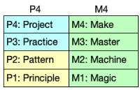
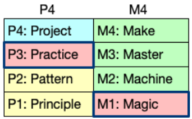
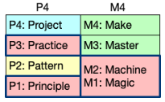
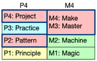

# A Student Guide to Software Engineering

This guide condenses the core lessons from `se_and_ase_courses.pdf` into a practical reference for students.

Each section contains direct references to the corresponding pages in `se_and_ase_courses.pdf` for further reading.

---

## The Basics of Software Engineering

### 1. Software Engineering

Software engineering is **professional problem-solving**.

- Software engineering is not only coding. It is **solving real-world problems effectively and professionally** using:
  - **Rules**
    - Principles and patterns
    - Proven approaches to solving problems
  - **Tools**
    - Programming languages, frameworks, IDEs,testing software
  - **Teams**
    - Communicating well
    - Collaborating effectively
- Software Engineer vs. Coder/Programmer:
  - **Coder:**
    - Writes code to make things work
  - **Software Engineer:**
    - Solves problems systematically, works effectively in teams, and produces **quality** software that users actually **need** and **value**

> (Source: `se_and_ase_courses.pdf`, pp. 3-8, 16-17)

### 2. Complexity

Complexity is **normal and must be managed effectively**.

- Software systems are **inherently complex**.
  - They are among the most complex things humans have ever created.
    - They have millions of parts that all need to work together perfectly.
  - Many failures come from poor complexity management.
- A major engineering skill is **reducing and controlling complexity while still delivering software products**.

> (Source: `se_and_ase_courses.pdf`, pp. 9-10)

### 3. Mindset

**Professional** vs **amateur** mindset

- **Amateur:**
  - Builds mainly for personal interest (does it for love and enjoyment).
  - **Amateur Software Developer:**
    - Writes code for fun on weekends
    - Works on problems that interest them personally
    - Can abandon projects anytime without consequences
    - No strict deadlines or pressure from clients
  - The word 'amateur' comes from Latin 'amator,' which means 'lover.'
- **Professional:**
  - Someone who makes money from doing something (does it for money and responsibility).
  - **Professional Software Engineer:**
    - Writes code to solve clients' real problems
    - Works on required projects (whether fun or not)
    - Must finish and support what they build
    - Meets deadlines and stakeholder expectations
  - Delivers reliable solutions under constraints (deadlines, stakeholder needs, support/maintenance responsibilities).
    - **Analogy:**
      - Professional baseball players get paid to play, while amateur players actually spend their own money to play baseball games.
  - Real professional behavior means doing high-quality work even when tasks are repetitive or not exciting (see example below).

Example:

> **THE BORING CRUD APPLICATION EXAMPLE:**
>
> **Amateur Thinking:** "CRUD operations are boring and repetitive. I want to build something exciting with AI instead!" → **Quits** the boring project and starts a new "exciting" one
>
> **Professional Thinking:** "This CRUD app processes $2 million in daily transactions. Even though it's not glamorous, I'll make it reliable, secure, and maintainable for our users." → **Delivers** excellent work even on "boring" projects

> (Source: `se_and_ase_courses.pdf`, pp. 11-15)

---

## ASE Learning Strategies

### 1. Build

Learn by building, not by passive consumption.

> "What I cannot create, I do not understand."
>
> \- Richard Feynman

- **Deep understanding** comes from **creating and implementing**, not just watching tutorials or reading notes.

**Feynman's 3-Step Technique:**

1. Write down the problem clearly.
   - If you can't clearly define and write down the problem, you can't solve it effectively.
2. Think very hard about it.
   - Thinking hard is nearly impossible when you don't clearly understand what you're supposed to solve.
3. Write down the solution.

> (Source: `se_and_ase_courses.pdf`, pp. 4-5, 20-24)

### 2. Make mistakes

Mistakes are required inputs for growth.

- **Failure** is reframed as **feedback**:
  - Make mistakes early
  - Learn quickly from mistakes
  - Prevent repeat mistakes with better systems/processes

  > (Source: `se_and_ase_courses.pdf`, pp. 4-5, 72)

### 3. Start immediately

Start before you feel fully ready and don't overthink it

- Identify **unknown unknowns** (things you don't even know that your don't know; i.e. unknown knowledge gaps) as soon as possible.
  - Once the unknown unknowns are revealed, they become **known unknowns** (things you now know that don't know)
- Waiting for perfect clarity causes delays and weaker outcomes.
- Learn as you go

> (Source: `se_and_ase_courses.pdf`, pp. 24-25, 66-68, 88-89)

### 4. Ask for help early

- **Seeking help is a sign of wisdom and professionalism**, not weakness.
- Prolonged silent struggle wastes time and hurts project outcomes.
- Reach out to Dr. Cho, the TAs, or classmates.

> (Source: `se_and_ase_courses.pdf`, pp. 89-90, 133)

---

## Core Frameworks

### 1. 4D process

4D process - project execution backbone

1. **Define** the problem and proposed solution.
   - The solution can be revised as needed.
2. **Design** architecture and component interactions.
   - Plan how all the pieces will fit together and work with each other.
3. **Develop** the implementation.
   - Build the application based on your design.
4. **Deploy** for real users.

> Define → Design → Develop → Deploy

- Understanding and mastery of the 4D process comes with doing projects step-by-step.

> (Source: `se_and_ase_courses.pdf`, pp. 29-31)

### 2. APT outcomes

APT outcomes - what ASE aims to build in you

- **A**pplications: build high-quality applications.
- **P**rocesses: apply software engineering processes effectively.
- **T**ools: use modern software development tools effectively.
- You must be able to **perform both independently and in teams**.

> (Source: `se_and_ase_courses.pdf`, pp. 32-33)

### 3. P4 framework

P4 framework - how learning activities are organized

- Theory (theoretical foundation):
  - **P1 - Principles**: foundational truths that explain how things work.
  - **P2 - Patterns**: reusable, proven solutions.
- Application:
  - **P3 - Practices**: repeated skill-building actions.
  - **P4 - Projects**: full integration through building.

**Analogy:**

- **Theory**
  - Like a **map** that **guides** you through unfamiliar terrain
  - Emerges naturally when you need it to solve problems
- **Application**
  - Like the actual journey, walking the path yourself, learning by doing, experiencing challenges firsthand
- Both are necessary for learning

> (Source: `se_and_ase_courses.pdf`, pp. 58-61)

### 4. M4 progression

M4 progression - how understanding develops

- Learning happens naturally in 4 stages:
  - **M1 - Magic**: confusion/black-box phase.
    - When you're a beginner, everything feels like magic — mysterious, confusing, and incomprehensible.
    - You run some code, and it works, but you have no idea why or how it actually works.
  - **M2 - Machine**: conceptual understanding appears.
    - As you learn the theory and practice more, things transform from magic into systems you actually understand.
    - The mysterious magic fades away and is replaced by real comprehension of how things actually work.
  - **M3 - Master**: competence and efficiency.
    - With lots of practice and experience, you gain real mastery.
    - You can solve problems efficiently and elegantly.
    - You know not just how to do something, but also why it works that way.
  - **M4 - Make**: create independently - deepest understanding.
    - By creating your own projects from scratch, you truly internalize and deeply understand what you've learned.
    - Creation is the ultimate test and proof of understanding.
    - "Make" doesn't just come at the end - you should be making things at every stage.

> Magic → Machine → Master → Make
>
> Confused → Understanding → Skilled → Creating

> (Source: `se_and_ase_courses.pdf`, pp. 53-57)

### 5. P4M4 model

### 6. 3 course stages

3 course stages - how projects evolve

1. **Preparation**
   - Setup
     - Set up development tools
     - Read important documents
     - Understand basic concepts
   - Makes you ready for projects.
   - Corresponds to P3M1

2. **Prototype/MVP**:
   - Skill-building through practice
   - Begins with the first iteration of the project and typically ends around the time of the first midterm.
     - Students should check the specific schedule for each course.
   - **Minimum Viable Product** (MVP):
     - The simplest version of your product that actually works and can be used.
     - The starting point of a real software engineering project.
     - Focus only on **checking feasibility**.
       - Feasibility means checking if we can actually solve the problem or not by answering the question 'is it even possible?'
       - Skip many important activities like proper requirements, thorough testing, and good documentation.
     - Corresponds to **P31/M12**
       - **Shifting focus** from:
         - Magic to Machine (M1 to M2)
         - Practice to understanding Principles (P3 to P1)

3. **Project**: deliver promised features with quality artifacts.

- Typically starts after the first midterm and continues until week 16.
- Key distinction:
  - **Prototypes** test feasibility quickly
  - **MVP/project** requires requirements, testing, and documentation quality
- Apply everything you've learned in class, and sometimes even beyond what we covered, to successfully finish the project.
- Prove you can solve real problems by implementing the features you promised to deliver.
- Make changes as necessary.
- Corresponds to **P24/M34**

> (Source: `se_and_ase_courses.pdf`, pp. 63-73)

---

## Course Path Across the ASE Program

### 1. Program-level design

- Courses are intentionally **connected**, not isolated.
- You repeatedly apply the **same core frameworks** while **increasing scope and difficulty**.

> (Source: `se_and_ase_courses.pdf`, pp. 26-33, 48-49)

### 2. Course roles

High-level view (for visual representations and more details, see pages 34-47 and 134-137 in `se_and_ase_courses.pdf`)

- **ASE 220**: full-stack foundation (focus on developing complete apps).
- **ASE 230**: deeper server-side/API/database focus + deployment exposure.
- **ASE 285**: cornerstone for team projects, tools, and security.
- **ASE 330**: UI/UX and human-centered product design.
- **ASE 420**: software design principles and UML literacy.
- **ASE 456**: architecture via cross-platform development.
- **ASE 485**: capstone integration of everything.

> (Source: `se_and_ase_courses.pdf`, pp. 34-47, 134-137)

---

## Grading, Habits, and Success Strategies

### 1. Grading

Grade structure emphasizes **performance**, not cramming

- Total possible points: **1000**
- Typical weighting (can be adjusted):

  | Component         | Points    | Percentage |
  | ----------------- | --------- | ---------- |
  | Assignments (5)   | 250       | 25%        |
  | Projects          | 350/400\* | 35%/40%\*  |
  | Midterm Exams (2) | 350       | 35%        |
  | Daily Quizzes     | 50/0\*    | 5%/0%\*    |
  - \* indicates online course
  - Can be changed for each course.
  - Earn up to 50 bonus points (an extra 5%) for helping to improve the course

> (Source: `se_and_ase_courses.pdf`, pp. 77-78)

### 2. Projects

Project work is career-critical

- Projects are portfolio **evidence of problem-solving ability**.
- Treat each course project as a potential **job interview artifact**.

> (Source: `se_and_ase_courses.pdf`, pp. 81-82, 91, 93)

### 3. Habits

Operational habits for success

- Start early.
- Take action before full certainty.
- Be proactive in planning and communication.
- Ask for help when stuck.

> (Source: `se_and_ase_courses.pdf`, pp. 88-91, 94)

### 4. Discipline

Deadline and extension discipline

- **Extensions:**
  - Extensions are possible if you request one at least 72 hours (3 days) before the due date. No penalty applies in this case.
  - Extension requests made **within 72 hours** of the due date incur a **20% late penalty** on that assignment. **No exceptions**.
  - A student who requests a deadline must submit a plan showing when they will finish the assignment.
  - If an extension deadline is missed, no second extension will be granted.
- **Planning ahead** prevents avoidable loss.
- Assignments are sequenced to **prepare you for project success**.

> (Source: `se_and_ase_courses.pdf`, pp. 79-80)

---

## Course Rules and Professional Conduct

### 1. Foundation

Four foundational rules

- **For students**: Integrity First; Two Hats Rule.
- **For professor/TA**: Be Fair; Help Students Succeed.

> (Source: `se_and_ase_courses.pdf`, pp. 95-98)

### 2. Integrity

Integrity is about **competence**, **trust**, and **future employability**

- Cheating undermines learning, team trust, and long-term professional capability.

> (Source: `se_and_ase_courses.pdf`, pp. 99-101)

### 3. Two Hats

Two Hats Rule - simultaneous roles

- Hat 1: professional problem-solver who delivers.
- Hat 2: student learner who experiments and improves through mistakes.

> (Source: `se_and_ase_courses.pdf`, pp. 102-103)

### 4. Principle-driven judgment

- Detailed policies derive from core principles.
- In ambiguous situations, use the **four rules** as a **decision compass**.
  - If unsure, ask immediately.

> (Source: `se_and_ase_courses.pdf`, pp. 108-111)

---

## Tools, Languages, and Documentation Skills

### 1. Tools

**Essential tool competency is non-negotiable.**

- Core tools include a modern IDE, version control, command line, and documentation/data formats.
- **Tool mastery** is part of **professional identity**, not optional overhead.

> (Source: `se_and_ase_courses.pdf`, pp. 114-121, 127-129)

### 2. GUI & CLI

GUI vs CLI is not a battle - choose by task

- GUI tools are intuitive.
- CLI is often faster, scriptable, and better for automation/workflow chaining.

> (Source: `se_and_ase_courses.pdf`, pp. 116-121)

### 3. Version control and collaboration baseline

- Git = local history and safe rollback.
- GitHub = collaboration, backup, visibility, workflow integration.

> (Source: `se_and_ase_courses.pdf`, pp. 122-124)

### 4. Team/project tools

Team/project tooling grows in upper-level courses

- Required examples include GitHub, GitHub Actions, and Docker.
- Additional PM/communication/deployment tools vary by team/project.

> (Source: `se_and_ase_courses.pdf`, pp. 124-126)

### 5. Representation

Use the right representation for the right purpose

- Markdown: human-readable docs.
- JSON: machine-friendly structured data.
- YAML/TOML: human-editable configuration.

> (Source: `se_and_ase_courses.pdf`, pp. 127-129)

### 6. Multi-language fluency

Multi-language fluency supports broader problem-solving

- The curriculum highlights complementary language strengths (OOP/design, automation/AI, web interactivity) rather than one-language dependency.

> (Source: `se_and_ase_courses.pdf`, pp. 129-131)

### 7. Continuous Learning

Learn new tools continuously

- Students are expected to **learn** unfamiliar tools **independently** over time.
- **Lifelong adaptability** is more durable than mastery of a single tool.

> (Source: `se_and_ase_courses.pdf`, pp. 125-126, 139-140)
